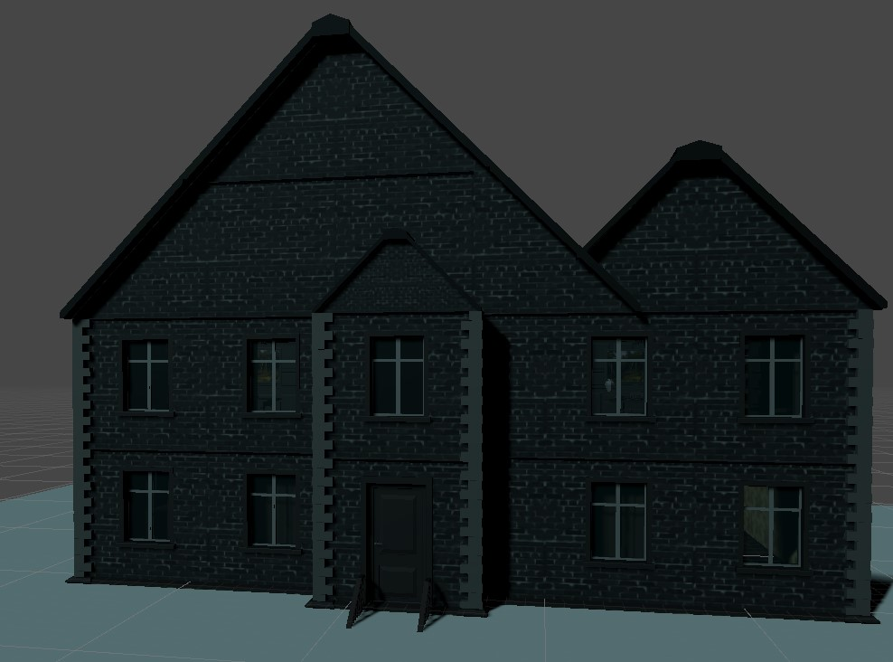

# Unity3D VR Escape Room
A VR Escape room in an old house made for a lecture at FH St. Pölten (Austria).

## Tools

| Software / Package                | Description / Link                                                                                  |
| --------------------------        | ------------------------------------------------------------------------------------- |
| Unity3D 2020.3.21 (LTS)           | https://unity3d.com/get-unity/download/archive                                        |
| Blender 2.9.xx                    | https://www.blender.org/download/                                                     |
| Virtual Reality Toolkit (VRTK)    | https://www.vrtk.io/                                                                  |

  

## License
[MIT](https://choosealicense.com/licenses/mit/)