# Unity3D VR Escape Room
A simple VR Escape room set in an old victorian house in low poly style. Made for education purpose at FH St. Pölten (Austria).
 

[ i ] Optimized for Oculus Quest

-> [Live Gameplay 1](https://vimeo.com/manage/videos/691512317) 
 
-> [Live Gameplay 2](https://vimeo.com/manage/videos/691513491)

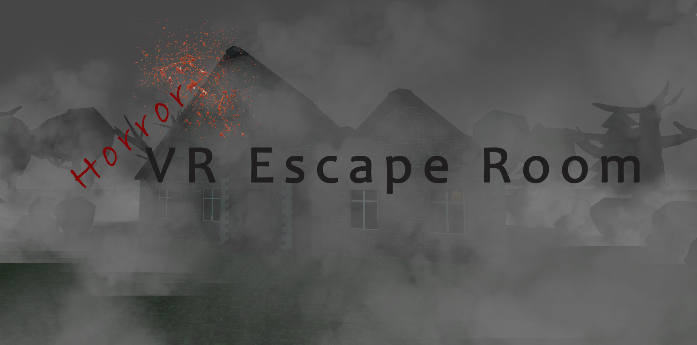

 
 

# Tools

| Software / Package                | Description / Link                                                                                  |
| --------------------------        | ------------------------------------------------------------------------------------- |
| Unity3D 2020.3.21 (LTS)           | https://unity3d.com/get-unity/download/archive                                        |
| Blender 2.8.xx                    | https://www.blender.org/download/                                                     |
| Virtual Reality Toolkit (VRTK)    | https://www.vrtk.io/                                                                  |
| Wwise    | https://www.audiokinetic.com/en/products/wwise                                                              |
| SoundQ   | https://www.prosoundeffects.com/soundq/                                                                |
| Reaper    | https://www.reaper.fm/download.php     
| FH St. Pölten VRTK Tutorial    | https://www.youtube.com/playlist?list=PLnrrFPvgClViJOfi-2MseS5W2DiKEB551                                      |

 
 

# Story
You are trapped in an old hunted house. The ghost misses two objects. 
Bring them back and he will let you go. Maybe... 
 
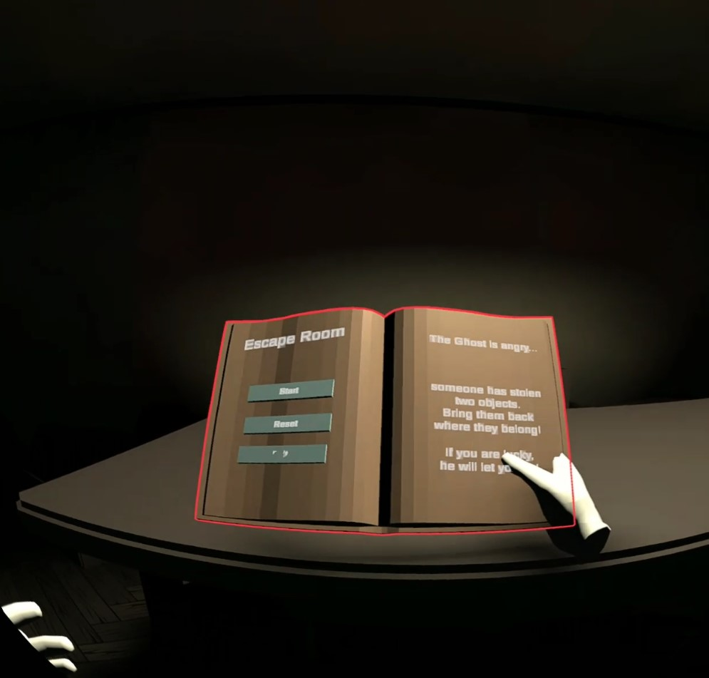

 
 

# Controls
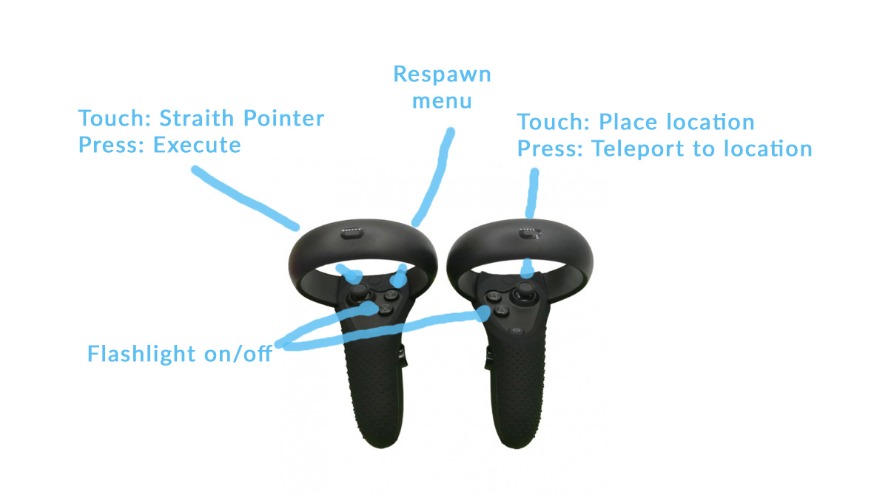

 
 

# Features

## Full Experience
Its a really small VR Game but it's a complete experience, with a start, pause menu and an end

 

## Unity VR Integration
Its an complete integration of the most important VRTK (Tilia) Elements which could be used as an Unity VR boilerplate. 
* **Pseudo Body**: An virtual body which prevents crossing walls
* **Interactors**: Custom Hand integration for interactions
* **Orientation Handels**: The flashlight has custom orientation handles, so it fits in the hand
* **Movement**: Integrated teleport and direct movement
* **Teleport Target**: Placed one teleport target which can be snapped
* **Outlines**: To make interactive objects visible

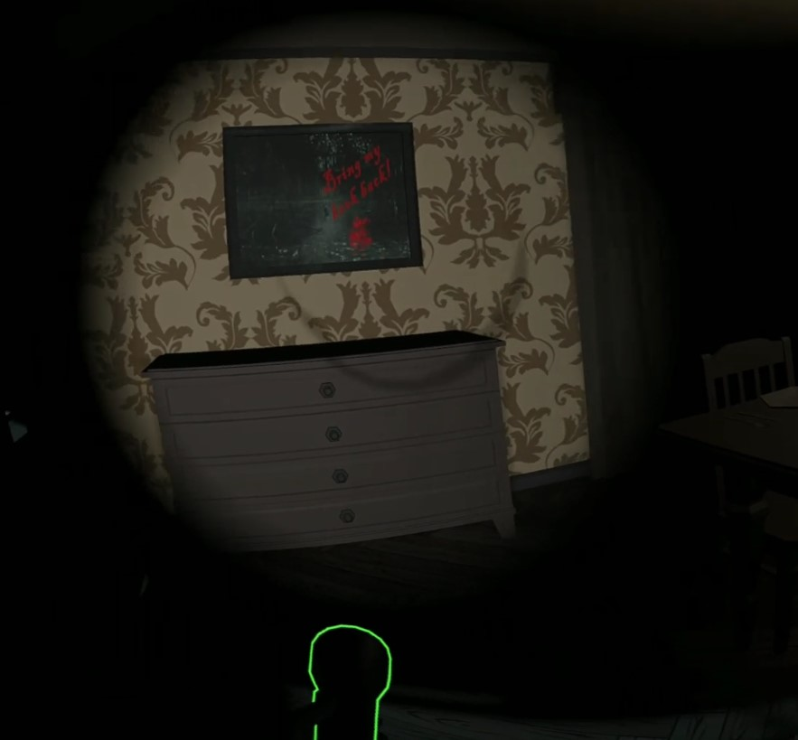

 

## Interactive Elements
* **UI**: Simple spartial buttons and dispatcher functionality
* **Interactables**: Interactable Objects which can be grabbed and allowing swap to other hand
* **Snap Zone**: There a some zone where a specific object has to be placed

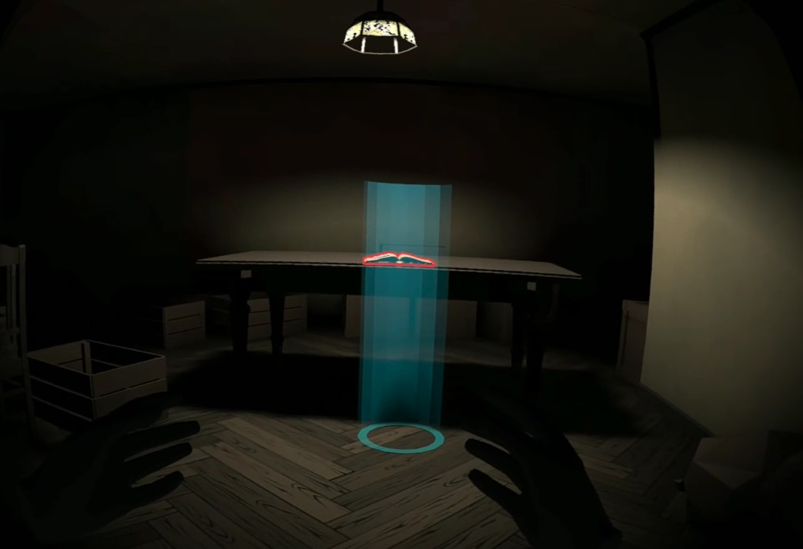

 

## Animations
Some simple Animations has been created, like open and close doors and randomized movement of a ghost

 

## Effects
Simple SFX, flickering lights and Fog effects have been implemented to create a scary atmosphere

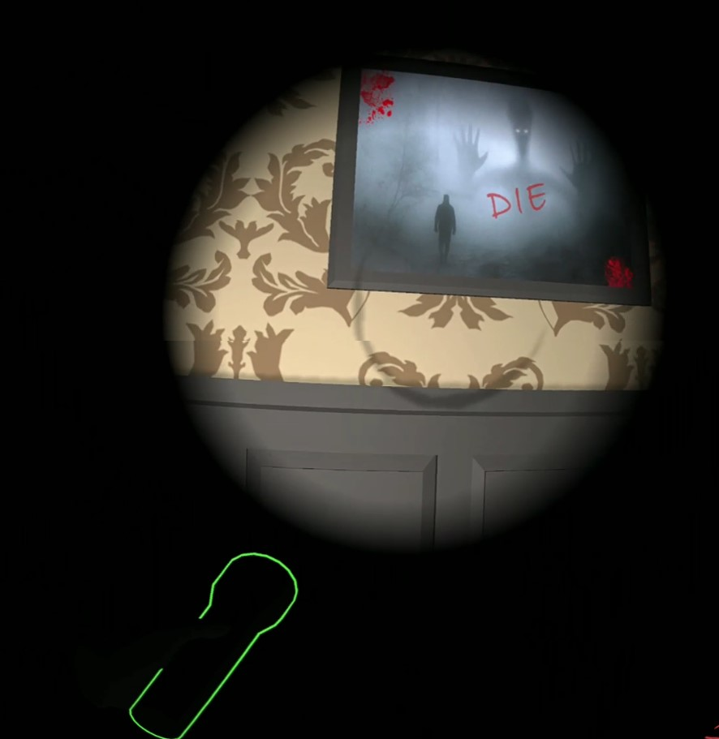

 

## Triggers
There are a couple of Triggers after some progress. Most of the time they create more tension by using sound effects or shadow

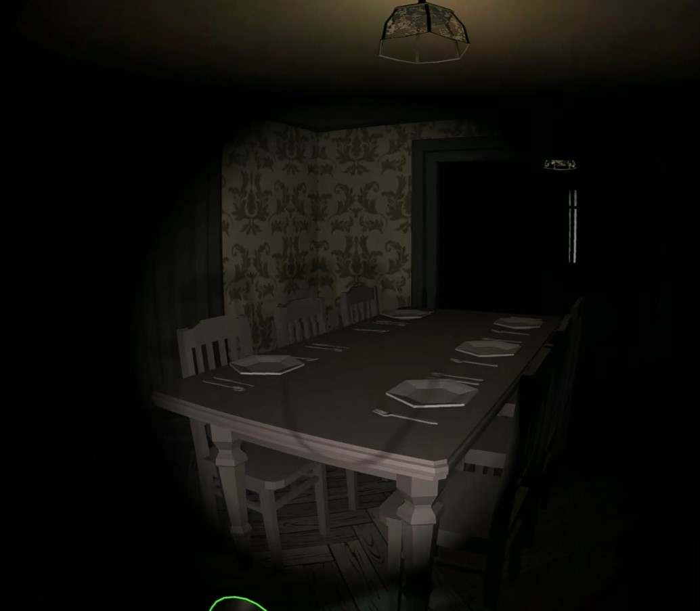

 

## Sound
All sound in the game has been downloaded from [freesound.org](freesound.org), by using the tool SoundQ. After downloading the audio by using SoundQ, it has been edited by Reaper and placed in Wwise. Its a pretty nice tool, with a direct integration to unity.

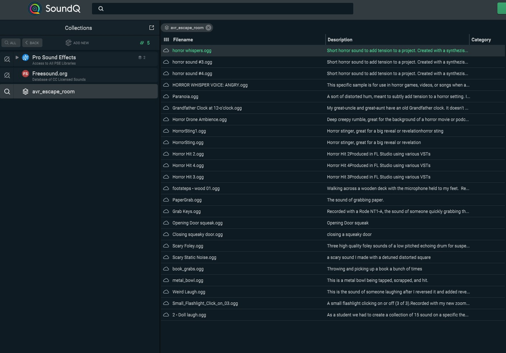
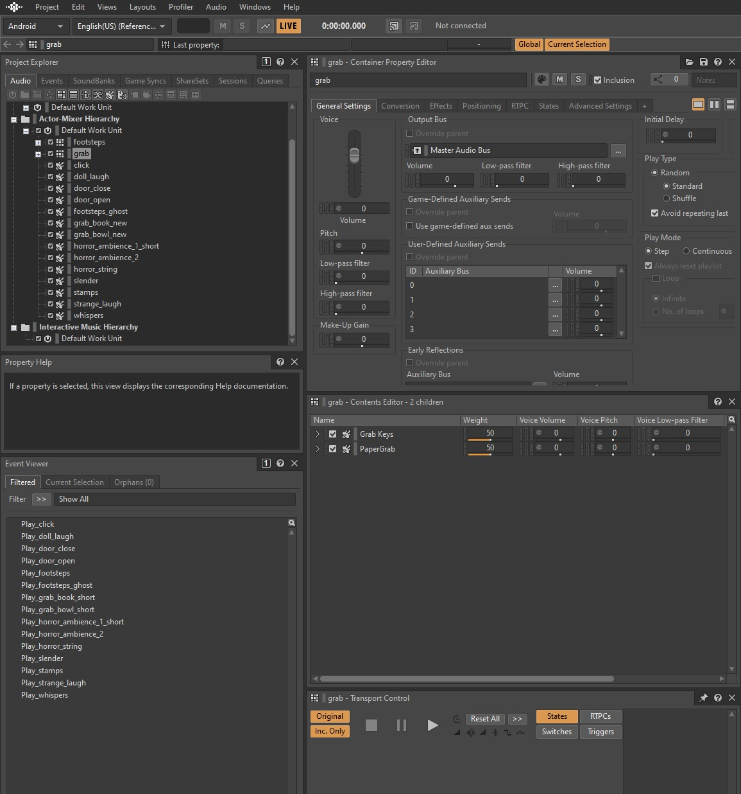

 

### Performance
The quality and graphics has been tweaked and optimized by running on around 50fps in an Oculus Quest 1. Mosty by following the linkedIn Tutorial [Shadows and quality](https://www.linkedin.com/learning/cert-prep-unity-certified-associate-game-developer-materials-and-lighting/shadows-and-quality?autoAdvance=true&autoSkip=false&autoplay=true&resume=true&u=68004706).

 
 

# Models
The following models have been made in blender.

## Main Menu book
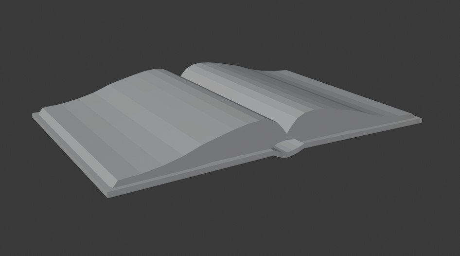

## Myserious book
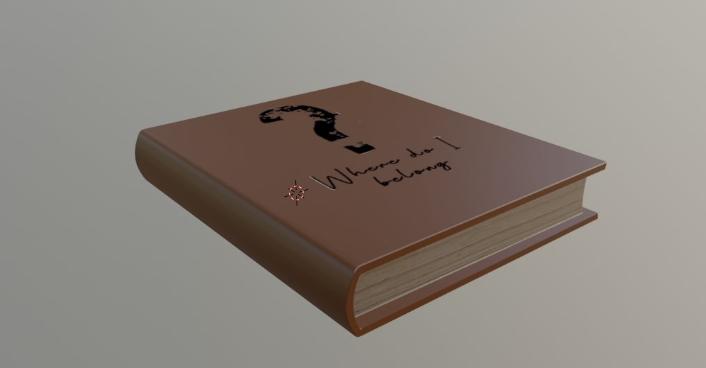

## Bowl
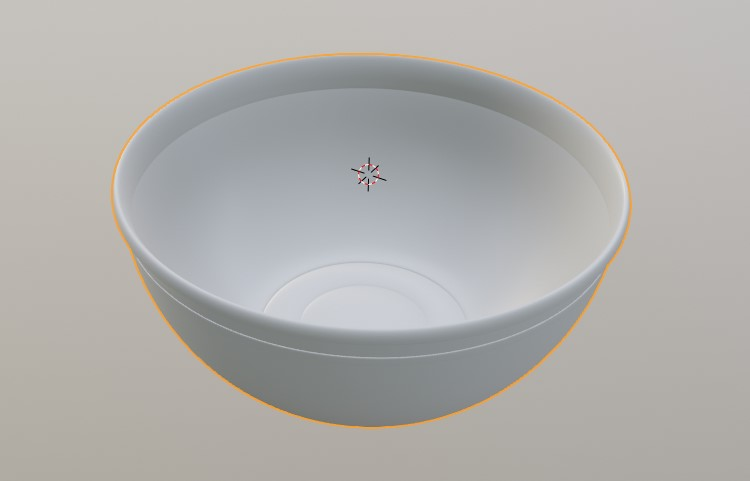

## Navigation arrow
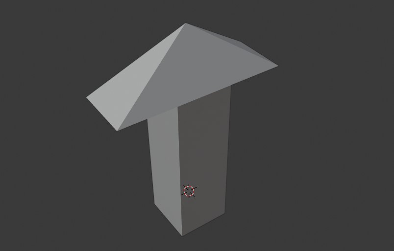

  

# License
[MIT](https://choosealicense.com/licenses/mit/)

 

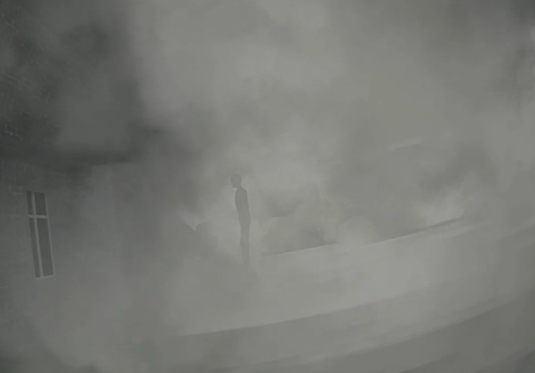